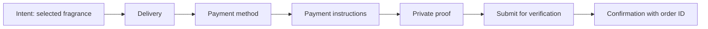

# Dotfumes Guided Checkout Ritual

Date: 2026-07-29
Status: proposed for implementation
Scope: checkout route, confirmation route, checkout state, order submission service, and Google Apps Script order POST flow

## 1. Purpose

Transform checkout from a premium-styled intake form into a guided luxury purchase with trustworthy payment handling.

The design preserves the existing Dotfumes identity:

- Playfair Display and Inter;
- brand white, ivory, black, gold, and existing semantic tokens;
- sharp corners;
- product photography;
- current route structure;
- current customer field names and field order;
- React Router, Zustand, Google Sheets, Google Drive, and Apps Script.

This is not a storefront redesign, payment-gateway migration, database rewrite, or brand refresh.

## 2. Success criteria

The completed system must:

1. guide the buyer through Intent, Delivery, Payment, Proof, and Confirmation;
2. keep the selected fragrance and amount visible or one expansion away;
3. keep the primary CTA enabled until a network request begins;
4. make every CTA state perform a useful action;
5. show the selected payment destination and exact payable amount before proof upload;
6. keep proof files private in Google Drive;
7. prevent the frontend from setting prices, totals, payment status, or order status;
8. recalculate the order from the Products and Settings sheets;
9. use one stable order ID as an idempotency key;
10. return an existing order for a safe duplicate retry;
11. distinguish confirmed success, local preparation, backend failure, and unknown timeout outcome;
12. pass desktop, mobile, accessibility, error-state, duplicate, and hydration QA.

## 3. Current-state diagnosis

### UX and hierarchy

- The campaign-sized heading and top padding delay useful controls.
- Decorative progress cards repeat section headings without adding navigation.
- The order summary follows the full form on mobile.
- Payment methods do not reveal any account or wallet destination.
- Proof upload appears before the buyer has enough information to pay.
- The disabled CTA hides why progress is blocked.
- Reassurance copy is duplicated near the final action.
- Empty checkout still exposes the full form.

### State and performance

- `CheckoutPage.tsx` owns layout, local form state, validation, proof preview, submission, copy, animation, and summary behavior.
- Validation runs during render and after every field change.
- Form state cannot survive a refresh or component extraction.
- The cart initially trusts fallback catalog data and can become invalid after remote hydration.
- Currency is hardcoded to USD even though catalog settings expose a currency.

### Trust and backend integrity

- The browser sends line prices, subtotal, delivery fee, total, payment status, order status, and generated operational copy.
- Apps Script writes those client values.
- Proof files are changed to `ANYONE_WITH_LINK`.
- The same order ID can be submitted repeatedly.
- A retry after a client timeout can create another file, row, stock decrement, and notification.
- Customer email failures are swallowed, while confirmation can still claim an email was sent.
- The frontend-only fallback says the request was received when it only exists in local storage.

## 4. Approved experience model



Intent is not a separate page or extra field. It is the selected fragrance, scent cue, quantity, and total carried into checkout.

The checkout remains one route with progressive disclosure:

1. Delivery is the first open section.
2. Payment becomes the next active section when delivery is valid.
3. Selecting a method prepares the instruction reveal.
4. The CTA requests a server-authored quote, then reveals the selected instructions.
5. Proof upload becomes available only after instructions are visible.
6. A valid proof changes the CTA to the final verification action.
7. Confirmation reports the actual backend result.

Section headings remain visible so the buyer understands the whole flow. Inactive sections are calm and non-interactive until the guiding CTA advances them.

## 5. Page composition

### CheckoutHeader

- Compact `Checkout` title.
- One short line: `Complete your delivery details, transfer the exact amount, and submit proof for private review.`
- No campaign-scale two-line headline.
- No second operational paragraph.

### CheckoutProgress

- Semantic ordered list: Delivery, Payment, Proof, Confirmation.
- Current item uses text, icon, and color.
- Completed items expose a check icon and accessible completed text.
- It does not render as four equal cards.
- It is informational, not clickable navigation.

### OrderSummary

Desktop:

- sticky right column;
- image, product name, quantity, line amount, and one short scent cue;
- item count, subtotal, delivery fee when non-zero, and server-configured currency;
- live inventory change message beside the affected line.

Mobile:

- appears before Delivery;
- compact closed state shows image, item count, and total;
- button exposes `aria-expanded` and `aria-controls`;
- open state shows the full selection and quantity controls.

### DeliveryDetailsSection

Preserve field names and order:

1. first name;
2. last name;
3. optional email;
4. phone;
5. delivery address;
6. city.

Labels remain above inputs. Validation appears on blur or after a guiding CTA attempt, not on the first keystroke. Phone uses `type="tel"` and `inputMode="tel"`. Email disables spellcheck.

### PaymentMethodSection

Use one semantic `fieldset` with a `legend`.

Each method row includes:

- method name;
- short transfer description;
- selected icon or mark;
- complete-row hit target;
- redundant selected state through border, fill, icon, and text.

Methods remain Bank Transfer, Easypaisa, and JazzCash.

### PaymentInstructionReveal

The selected method reveals:

- bank or wallet name;
- account title or wallet recipient;
- account number, IBAN, or wallet number;
- exact payable amount;
- `Copy Account Number` or `Copy Wallet Number`;
- `Copy Exact Amount`;
- short instruction to keep the transaction reference visible in proof.

Payment destinations are public operational configuration, not source literals. They come from allow-listed Settings sheet keys returned by the public catalog/settings response. No secret, admin token, script URL, or private property is exposed.

Required settings:

- `bankName`;
- `bankAccountTitle`;
- `bankAccountNumber`;
- optional `bankIban`;
- `easypaisaRecipient`;
- `easypaisaNumber`;
- `jazzcashRecipient`;
- `jazzcashNumber`;
- `deliveryFee`;
- `currency`.

If the selected method is not configured, the section displays a blocking inline operational error and the final submit state is unavailable.

### PaymentProofField

- Appears after payment instructions are revealed.
- Accepts JPG, PNG, WEBP, and PDF up to 5 MB.
- Keeps `File` and object URL local to the component.
- Shows a compact attached state: file type, safe filename, size, and replace/remove controls.
- An image thumbnail may appear in the local form only.
- Confirmation never renders the proof preview or Drive URL.
- Removing a file requires no confirmation because it is reversible and local.

### CheckoutTrustBar

Three short claims, each backed by behavior:

- `Manual Verification`: server forces pending-verification status.
- `Order ID Tracking`: stable order ID and server duplicate lookup.
- `Private Review`: no public Drive sharing and no proof URL in the customer response.

The bar appears beside the final action. It replaces the two current reassurance cards.

### CheckoutSubmitBar

One primary CTA and one quiet return link.

The CTA keeps the existing primary button visual treatment. The button is enabled until a request starts. Clicking it either advances, focuses the next requirement, opens the proof picker, or submits.

## 6. CTA state machine

| State | Label | Behavior |
| --- | --- | --- |
| Initial stage | `Continue` | Move focus to Delivery and announce the next requirement |
| Missing untouched delivery | `Add Delivery Details` | Focus the first empty required delivery field |
| Invalid or partial delivery | `Complete Delivery Details` | Reveal relevant errors and focus the first invalid field |
| Delivery valid, no payment method | `Select Payment Method` | Focus the payment fieldset |
| Payment selected, instructions hidden | `Continue to Payment Instructions` | Request an authoritative quote, then reveal and focus the selected method instructions |
| Quote request active | `Preparing Payment Instructions…` | Disable only during the quote request and expose `aria-busy` |
| Instructions visible, proof missing or invalid | `Add Payment Proof` | Focus or open the file input and announce proof requirements |
| Ready | `Submit for Verification - {TOTAL}` | Submit the stable order ID to Apps Script |
| Request active | `Sending Request…` | Disable only during the active request and expose `aria-busy` |

`Add Payment Proof` is an explicit derived state required by the always-guided rule. Without it, the specified flow would have a dead state after instructions are visible and before proof is attached.

The CTA label is produced by one pure selector from stage, validation, payment method, quote state, instruction visibility, proof state, catalog state, and submission state. Components do not duplicate label conditions.

## 7. Frontend architecture

### Component boundaries

`CheckoutPage.tsx` becomes a route orchestrator. It reads narrow store selectors, composes sections, and owns submission coordination. It does not render every field.

New files:

- `src/components/checkout/CheckoutHeader.tsx`
- `src/components/checkout/CheckoutProgress.tsx`
- `src/components/checkout/OrderSummary.tsx`
- `src/components/checkout/DeliveryDetailsSection.tsx`
- `src/components/checkout/PaymentMethodSection.tsx`
- `src/components/checkout/PaymentInstructionReveal.tsx`
- `src/components/checkout/PaymentProofField.tsx`
- `src/components/checkout/CheckoutTrustBar.tsx`
- `src/components/checkout/CheckoutSubmitBar.tsx`
- `src/components/checkout/CheckoutInput.tsx`

Supporting files:

- `src/store/useCheckoutStore.ts`
- `src/lib/checkoutGuidance.ts`
- `src/lib/paymentInstructions.ts`
- updated `src/hooks/useCheckoutValidation.ts`
- updated `src/contracts/checkout.contract.ts`
- updated `src/services/orderSubmissionService.ts`
- updated `src/lib/googleSheetsBackend.ts`
- updated `src/models/order.ts`

### State ownership

#### Cart store

Owns:

- items;
- quantity mutations;
- existing drawer state.

Cart item price remains display data only. It is never authoritative at submission.

#### Catalog store

Owns:

- products;
- inventory;
- public checkout settings;
- currency;
- hydration and refresh status;
- catalog error.

Checkout waits for initial hydration before allowing final submission. If the remote catalog fails, the UI clearly reports that live availability could not be confirmed. It does not silently present fallback stock as verified inventory.

#### Checkout store

Owns:

- current semantic stage;
- delivery values;
- selected payment method;
- touched fields;
- in-memory validation errors;
- instruction visibility;
- current server-authored quote;
- stable order ID.

Persistence:

- use Zustand `persist` with `sessionStorage`;
- persist delivery values, selected method, current stage, instruction visibility, order ID, and the current unexpired server-authored quote;
- do not persist errors, touched state, `File`, object URL, loading state, or backend error;
- clear the checkout draft only after confirmed backend success;
- use narrow selectors and `useShallow` for grouped fields.

#### Local component state

`PaymentProofField` owns:

- `File | null`;
- object preview URL;
- local file-picker state.

`CheckoutPage` owns:

- active request controller;
- transient submission error;
- unknown-outcome recovery state.

### Validation

Validation becomes pure and stage-aware:

- `validateDelivery(values)`;
- `validatePaymentMethod(method, instructions)`;
- `validateProof(file)`;
- `validateCheckout(input)`.

Field errors appear after blur or CTA guidance. The final validation runs again before submission. Error order follows visual and DOM order.

## 8. Authoritative quote before payment

The buyer must know the exact amount before making a transfer. A final-submit-only recalculation is too late because proof is collected after payment.

Selecting a payment method does not reveal a client-calculated amount. `Continue to Payment Instructions` first calls an Apps Script quote action with the stable order ID and item identifiers/quantities.

The quote action:

1. validates the public token, order ID, items, and quantities;
2. reads current Products and Settings sheet values;
3. validates active status and stock;
4. calculates line totals, delivery fee, currency, and total;
5. creates an HMAC-signed opaque quote token using a private Script Property;
6. returns the authoritative line items, total, currency, expiry, and quote token.

The quote is valid for 30 minutes. The quote token binds:

- order ID;
- normalized item identifiers and quantities;
- server prices;
- delivery fee;
- currency;
- issued-at time;
- expiry.

The private signing key never leaves Script Properties. The browser may persist the opaque quote token in session storage, but cannot alter a signed amount.

The final order POST verifies the token, order ID, items, quantities, and expiry. It honors the valid server-signed price instead of accepting a browser price. It still revalidates inventory inside the lock.

If the quote expires before proof submission, the UI requests a fresh quote and asks the buyer to confirm the new amount before accepting proof. If stock changes after payment but before proof submission, the backend creates no duplicate or false success; it returns a manual-resolution error tied to the stable order ID so Dotfumes can reconcile the paid customer.

### Quote contract

```ts
interface CreateOrderQuoteRequest {
  token: string;
  honeypot: string;
  action: 'quote';
  orderId: string;
  items: Array<{
    productId: string;
    sku?: string;
    slug: string;
    quantity: number;
  }>;
}

interface CreateOrderQuoteResponse {
  success: true;
  orderId: string;
  currency: string;
  items: Array<{
    productId: string;
    sku?: string;
    name: string;
    quantity: number;
    unitPrice: number;
    lineTotal: number;
  }>;
  subtotal: number;
  deliveryFee: number;
  total: number;
  issuedAt: string;
  expiresAt: string;
  quoteToken: string;
}
```

## 9. Browser-to-server order contract

The POST payload contains only claims the customer is allowed to make:

```ts
interface SubmitOrderRequest {
  token: string;
  honeypot: string;
  idempotencyKey: string;
  quoteToken: string;
  customer: {
    firstName: string;
    lastName: string;
    phone: string;
    email: string;
    address: string;
    city: string;
  };
  paymentMethod: 'bank-transfer' | 'easypaisa' | 'jazzcash';
  items: Array<{
    productId: string;
    sku?: string;
    slug: string;
    quantity: number;
  }>;
  proof: {
    fileName: string;
    mimeType: string;
    fileSize: number;
    base64: string;
  };
}
```

The request excludes:

- product name as authority;
- unit price;
- line total;
- subtotal;
- delivery fee;
- total;
- payment status;
- order status;
- admin notes;
- WhatsApp message;
- created timestamp as authority.

The response contains:

```ts
interface SubmitOrderResponse {
  success: true;
  orderId: string;
  duplicate: boolean;
  createdAt: string;
  currency: string;
  items: Array<{
    productId: string;
    sku?: string;
    name: string;
    quantity: number;
    unitPrice: number;
    lineTotal: number;
  }>;
  subtotal: number;
  deliveryFee: number;
  total: number;
  paymentMethod: PaymentMethod;
  paymentStatus: 'Pending Verification';
  orderStatus: 'New';
  notifications: {
    ownerEmail: 'sent' | 'failed';
    customerEmail: 'not-requested' | 'sent' | 'failed';
  };
}
```

It excludes:

- Drive file ID;
- Drive file URL;
- proof preview URL;
- admin-only notes;
- admin token or script properties.

## 10. Apps Script integrity design

### Request gate

Before file decoding or writes:

1. parse payload;
2. validate honeypot and public form token;
3. validate the idempotency key format;
4. verify the quote token signature, order ID, item quantities, and expiry;
5. validate customer fields;
6. validate payment method against the allow-list;
7. validate item identifiers and quantities;
8. validate proof metadata and base64 size/type.

### Idempotency and critical section

Acquire the script lock before checking or mutating order state.

Inside the lock:

1. find the Orders row by Order ID;
2. if found, return the stored authoritative order with `duplicate: true`;
3. read public settings and the Products sheet;
4. resolve each item by product ID, SKU, or slug;
5. reject missing, inactive, or insufficient-stock items;
6. read current product names and stock;
7. use the verified server-signed quote prices, delivery fee, currency, and total;
8. force payment status to `Pending Verification`;
9. force order status to `New`;
10. upload the proof without changing Drive sharing;
11. append one authoritative order row;
12. decrement stock once;
13. release the lock.

Notifications run after the critical section. Their failures do not roll back a stored order, but their real outcome is returned to the frontend.

### Failure compensation

The write helper records the created Drive file and appended row. If a storage or stock mutation fails before the critical section completes:

- restore any changed stock cells from captured original values;
- remove the incomplete order row;
- move the uploaded proof file to trash;
- return a generic customer-safe error;
- log the order ID and internal error for the operator without logging proof content or customer details.

### Private proof

Remove:

```js
file.setSharing(DriveApp.Access.ANYONE_WITH_LINK, DriveApp.Permission.VIEW);
```

The file inherits the private folder permissions. The admin sheet may retain the private Drive URL for authorized operators. Customer-facing responses and persisted frontend order state do not receive it.

### Server pricing

`readProductSheetState_` adds price and currency-relevant data. Quote calculation uses finite, non-negative prices and integer quantities. It rejects invalid catalog prices rather than falling back to a client value.

Delivery fee comes from the Settings sheet. The server owns the default when the setting is absent. Final submission accepts only a valid server-signed quote and never a browser total.

## 11. Submission outcomes

### Confirmed backend success

- save the authoritative response;
- clear cart and checkout draft;
- refresh catalog;
- navigate to confirmation;
- show order ID, total, pending-verification status, and real notification status.

### Duplicate success

- treat as successful recovery;
- do not create new local order data;
- navigate to the same confirmation state;
- show `Submission confirmed` rather than another success claim.

### Validation or stock rejection

- keep cart and draft;
- show the server message beside the relevant section;
- refresh catalog when stock or price changed;
- focus the affected summary or field.

### Timeout or connection loss

- keep cart, proof, draft, and stable order ID;
- do not claim success or failure;
- show `We could not confirm the result. Retry safely with the same order ID.`;
- retry uses the same idempotency key;
- do not clear any state until the server confirms.

### Frontend-only fallback

Fallback is used only when the Apps Script backend is intentionally unconfigured, not as a silent response to a network error.

- validate locally;
- prepare a local order summary;
- do not claim the order was received;
- do not clear the cart;
- confirmation mode says `Prepared locally`;
- primary action is `Send Request on WhatsApp`;
- customer attaches proof manually in WhatsApp;
- no private-proof promise appears because the backend did not receive the file.

## 12. Confirmation design

The confirmation route keeps:

- selected product;
- authoritative total;
- order ID;
- payment method;
- pending-verification status;
- WhatsApp handoff where useful.

It changes:

- no proof preview or Drive URL;
- no unconditional email-sent claim;
- notification copy derives from returned notification status;
- frontend fallback is clearly `Prepared locally`;
- confirmed backend orders say `Submitted for verification`;
- duplicate recovery says `Submission confirmed`;
- one primary next action per mode.

## 13. Motion and visual behavior

Design read: preserve-mode luxury ecommerce checkout for a trust-sensitive manual transfer flow.

Design dials:

- variance: 6;
- motion: 4;
- density: 4.

Motion is limited to:

- payment selected state;
- instruction reveal;
- proof attached state;
- request-state transition;
- confirmation entrance.

All motion:

- uses existing duration and easing tokens;
- uses transform and opacity;
- is interruptible;
- respects reduced motion;
- has strict effect cleanup.

No parallax, marquee, scroll animation, decorative loop, new gradient, glow, or new radius is added.

## 14. Accessibility

- Maintain the global skip link and main landmark.
- Use an ordered list for semantic progress.
- Use `fieldset` and `legend` for payment methods.
- Keep labels above all fields.
- Use `aria-invalid` and `aria-describedby`.
- Use one `aria-live="polite"` status region for guidance and submission updates.
- Use `aria-busy` on the form during request.
- Keep the primary CTA enabled until request start.
- Focus the first invalid field or next required section.
- Restore focus after mobile summary collapse and proof-picker interactions.
- Provide 44px mobile targets.
- Keep filename and product-name containers break-safe.
- Preserve zoom, browser autofill, keyboard navigation, paste, and reduced motion.

## 15. QA plan

### Automated frontend

Add checkout-focused Playwright coverage for:

1. empty cart recovery;
2. default CTA focuses Delivery;
3. partial delivery reveals and focuses the first invalid field;
4. valid delivery advances to Payment;
5. each payment method requests and reveals the correct server-authored quote and instruction set;
6. quote payload omits browser price and status fields;
7. invalid, expired, or altered quote tokens fail;
8. copy controls copy the intended public value and quoted amount;
9. proof remains unavailable before instructions;
10. invalid type, empty file, and oversized proof;
11. ready CTA includes the server-quoted total;
12. final request payload omits all authoritative price and status fields;
13. network activity is the only disabled CTA state;
14. server rejection preserves cart and draft;
15. timeout preserves the order ID and retries safely;
16. duplicate response becomes confirmed success;
17. frontend fallback uses honest local-preparation copy;
18. catalog hydration blocks quote/final submission and reports changed inventory;
19. mobile summary precedes Delivery and expands accessibly;
20. desktop summary remains sticky;
21. keyboard order and error focus;
22. reduced-motion state transitions.

### Apps Script verification

Before production deployment, verify in a staging sheet and Drive folder:

1. client price/status fields are ignored or absent;
2. quote uses the current sheet price and configured delivery fee;
3. altered or expired quote tokens fail;
4. invalid and inactive products fail;
5. insufficient stock fails;
6. valid order creates one row, one private file, and one stock decrement;
7. repeat order ID returns the same order with no new mutation;
8. proof file is not link-public;
9. owner and customer notification statuses match real outcomes;
10. forced payment and order statuses cannot be overridden;
11. compensation removes partial row/file and restores stock after injected failure.

There is no `.clasp.json` or Apps Script test harness in the repository. Production ship readiness therefore requires either adding a controlled staging deployment workflow or completing these checks through the existing Apps Script deployment process. The code must not be presented as production-ready solely because local TypeScript and browser tests pass.

### Visual and design QA

Source visual truth:

- the approved Guided Closing Ritual design specification;
- reference patterns `07`, `13`, `18`, and `20`;
- the current rendered checkout as brand and structure ground truth.

Required captures:

- desktop 1440 x 900;
- mobile 390 x 844;
- default;
- partial validation;
- each payment method;
- instruction reveal;
- proof attached;
- loading;
- error;
- confirmation;
- empty cart;
- catalog hydration delay.

The final `design-qa.md` must compare source and implementation in one combined comparison input. It passes only with no P0, P1, or P2 findings.

## 16. File-level impact and risk

| Area | Files | Risk | Control |
| --- | --- | --- | --- |
| Route composition | `src/pages/CheckoutPage.tsx` | Medium | Component extraction, e2e flow tests |
| Checkout components | `src/components/checkout/*` | Medium | Existing tokens, semantic markup, visual QA |
| Checkout state | `src/store/useCheckoutStore.ts` | Medium | Narrow selectors, session-only partial persistence |
| Validation and CTA | `src/hooks/useCheckoutValidation.ts`, `src/lib/checkoutGuidance.ts`, contract | Medium | Pure selectors and field-order tests |
| Cart/catalog | both existing stores | Medium | Hydration gate, no cart-store expansion |
| Quote and submission contract | models, service, Google Sheets helper | High | Signed quote verification, runtime response validation, intercepted request tests |
| Apps Script pricing/idempotency | `apps-script/dotfumes-order-webapp.gs` | High | Lock, duplicate lookup, authoritative calculation, staging tests |
| Drive privacy | Apps Script upload helper | High | Remove link sharing, verify file permissions |
| Confirmation | `src/pages/OrderConfirmationPage.tsx`, storage | Medium | Mode-aware state tests, no proof reference |
| E2E QA | `tests/e2e/checkout.spec.ts` | Low | Deterministic route and response fixtures |

## 17. Delivery sequence

1. Add failing tests for the current CTA, request contract, timeout retry, and duplicate behavior.
2. Introduce typed contracts and pure guidance/validation helpers.
3. Add checkout store with session-only safe persistence.
4. Extract checkout components without changing brand tokens.
5. Implement progressive disclosure and the CTA state machine.
6. Add the server-authored quote endpoint, signed quote token, public payment-instruction settings, and exact-amount display.
7. Harden Apps Script final request validation, statuses, privacy, compensation, and idempotency.
8. Update submission outcomes and confirmation copy.
9. Test desktop, mobile, quote expiry, hydration, failure, timeout, and fallback flows.
10. Capture same-state source and implementation evidence.
11. Run design QA until no P0, P1, or P2 findings remain.
12. Run lint, build, e2e, and staging Apps Script verification.

## 18. Explicit non-goals

- New payment gateway.
- SQL or managed backend migration.
- Account login or customer portal.
- New product recommendations or upsells.
- Storefront or admin redesign.
- New brand tokens, fonts, colors, radii, or icon family.
- New URL routes or renamed customer fields.
- Public proof links.
- Fabricated security badges, reviews, press, or delivery promises.

## 19. Acceptance statement

The checkout is ready to ship only when the buyer can always understand and act on the next step, a server-authored exact amount and payment instructions precede proof, product context remains present, the server owns financial and status truth, proof files remain private, retries cannot duplicate an order, and confirmation copy reflects the actual submission outcome.
